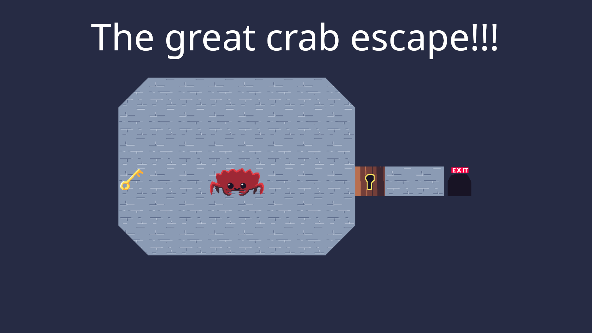

# Crab Escape

A puzzle game for the Trijam #377, theme was crabs so my idea was a puzzle game where you need to help crabs that can only move sideways escape.

## Attribution

Code was mostly Claude working from a template I made for doing Phaser games with Vite, maps/gfx/gameplay was myself and SFX/BGM are from [OtoLogic.jp](https://otologic.jp/).

## Requirements
- Node JS (v24+) with PNPM

## Setup

```bash
pnpm install
```

## Development (VS Code)

You can use the `Complete development` a Vite Dev Server and Chrome with the Debugger hooked up.

Putting/removing breakpoints in the `.ts` files with VS Code in `/src` should then work.
If it does not, please open an issue.

Edit the TypeScript files, the browser should automatically refresh after saving.

## Development (Terminal)

You can also start the development server by executing the following command within the repo:
```bash
pnpm dev
```

You should then see the example in your Browser on http://localhost:5137/

## Publish to itch.io / Ludum Dare

You can create a zip file in a format that should work with both itch.io and Ludum Dare by running the following command :`pnpm run zip`
